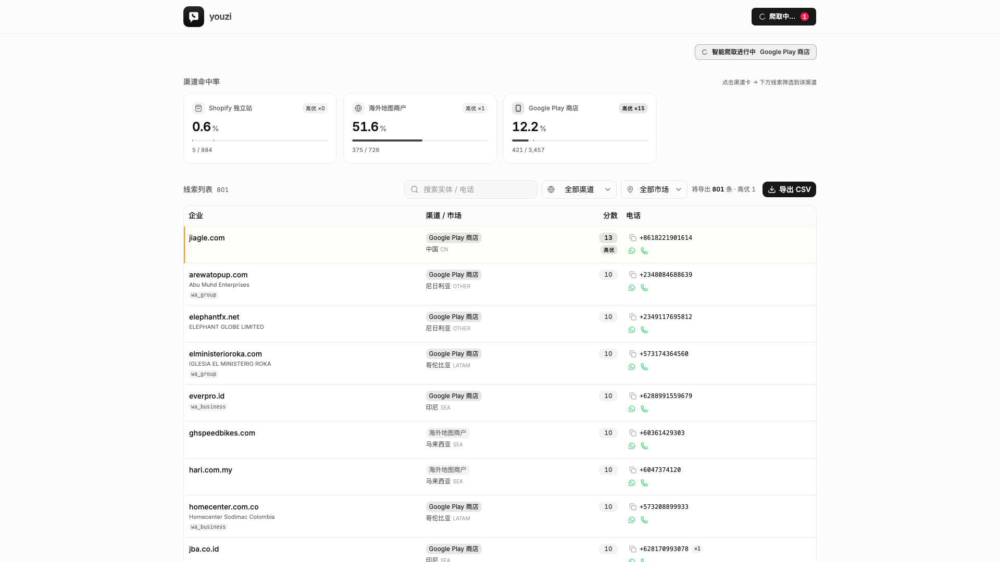

<div align="center">


**把散落在全球企业官网上的 WhatsApp 号码，挖成一份能直接交给销售的线索库。**


[快速开始](#快速开始) · [用法](#两种用法) · [工作原理](#工作原理) · [排障](#排障)

</div>

<br/>

> [!IMPORTANT]
> **合规红线** — 本工具只做线索发现与准备，**不含任何外联 / 发送能力**。
> 不对爬到的号码做 WhatsApp 群发或自动化营销；不引入反爬绕过层，被站点挑战即弃站。
> 部署在海外 VPS（CN 出口会被部分站点降级 / 拒绝）；欧盟线索触发 GDPR，删除响应是必选项。

---

## 为什么是 WhatsApp 号码

在东南亚、拉美、中东，WhatsApp 就是做生意的默认通道——印尼小店用它接外卖订单，圣保罗的电商用它催付款，迪拜的贸易商用它谈柜子。一家企业肯把号码挂上官网，等于把「接生意」三个字写在了门口：公开、免费、可验证。

LeadHub 把这个信号做成流水线：全量收集 → 验证归一 → 打分分组 → 交付销售。

- **P0** — 中国出海企业，同类客户，销售最先敲的一批门
- **P1+** — 海外本土企业，按 SEA / LATAM / MENA / EU 分组，语言和市场策略跟着组走

## 核心特性

- **🔍 两层检测** — `wa.me` 直链、9 种 widget 指纹、文本层关键词邻域 + libphonenumber 校验
- **🇨🇳 P0 出海判定** — 开发者主体 / ICP 备案 / 中国 TLD / 语言信号五条规则，中国出海企业一眼可辨
- **⚡ 一键智能爬取** — 渠道 / 国家 / 类目全由后端按 ROI 自动决策
- **🧠 智能调度** — 渠道按 ROI 评分排序，出错自动冷却，种子见底自动扩
- **📋 今日商机 API** — 每日待跟进清单，按市场组配开场白草稿和 wa.me 深链（人工发，不代发）
- **💾 断点续爬** — JOBDIR 状态落盘，进程重启不重爬
- **🛡 合规内建** — robots / 限速 / 每站页数上限全默认开，GDPR 删除一条命令

## 界面一览



*渠道命中率卡片点击即筛选；每条线索带 wa.me 深链、一键复制电话；工具栏右侧「导出 CSV」按当前渠道 / 市场筛选导出（4 列：entity / channel / market / phones，UTF-8 BOM）。行底色 + 左侧色条按 p0 + 分数提示优先级（红 = 最优先、琥珀 = 次优）*

## 环境要求

- **Python 3.13+**（CI 以 3.13 跑全量测试）
- **Node ≥ 20.19 / pnpm 9+** —— 仅改前端时需要
- **可选依赖**：`.venv/bin/pip install google-play-scraper`——不装则 Play 渠道不可用，OSM / Tranco / 手动清单不受影响
- 海外网络环境；CN 出口需配代理（见 [配置](#配置) 与 [排障](#排障)）

## 快速开始

```bash
git clone https://github.com/youzilovezp/youzi-leadhub.git && cd youzi-leadhub

python3 -m venv .venv && .venv/bin/pip install -r requirements.txt
.venv/bin/python -m pytest tests/ -q

# 后端 API :8788（从仓库根目录起）
.venv/bin/uvicorn app.api:app --host 0.0.0.0 --port 8788

# 前端开发模式 :5173（生产模式 pnpm build 后由 8788 直接托管）
cd frontend && pnpm i && pnpm dev
```

打开 `http://127.0.0.1:8788` 即可。

---

## 两种用法

### 界面

- **智能爬取** —— 后端按 ROI 自动挑渠道增量采集，同时按业务场景在后台扩新人群；跑完列表自动刷新。
- **所有线索** —— 渠道命中率卡片、搜索、市场 / 渠道过滤；每条线索带 wa.me 深链、一键复制电话。
- **导出 CSV** —— 工具栏右上角按钮，按当前渠道 / 市场筛选导出 4 列（entity / channel / market / phones）。

今日商机清单与开场白草稿走 API（`GET /api/today`），按市场组自动配语言。

### 命令行

```bash
# 种子
.venv/bin/python -m app seed tranco    --top 2000
.venv/bin/python -m app seed play      --country id --category BUSINESS --limit 200
.venv/bin/python -m app seed osm       --country MY,TH,PH,ID --limit 500
.venv/bin/python -m app seed sample    --file your-list.txt

# 爬取
.venv/bin/python -m app crawl --seed-file data/seeds-play.txt --channel play --limit 6038

# 统计 + 导出
.venv/bin/python -m app stats
.venv/bin/python -m app export --out data/leads.csv

# GDPR 删除响应
.venv/bin/python -m app forget --entity example.com
```

## 智能调度

每个渠道维护一个滚动窗口（最近 200 次尝试）的命中率与错误率：

```
score = hit_rate / (1 + error_rate × 10)
```

分数高的先爬；连续 5 次出错进 5 分钟冷却，不在快死的渠道上烧预算；种子池见底自动扩。当前策略面板可见（`/api/crawler/strategy`），冷却可手动解除。

## 配置

零配置可跑；环境变量完整示例见 [.env.example](.env.example)。

| 变量 | 默认 | 说明 |
|------|------|------|
| `BSP_DB` | `data/leads.db` | SQLite 数据库路径 |
| `BSP_PROXY` | 自动探测 | 出海代理：显式指定 URL；设为空串强制直连；不设则探测本机 `127.0.0.1:7890`，再退直连 |
| `BSP_CORS_ORIGINS` | 本机 origin | 跨源访问（局域网 IP / 域名）时覆盖，逗号分隔 origin 列表 |
| `YOUZI_DOWNLOAD_DELAY` | 任务注入 | Scrapy 下载间隔（秒），排障时手动覆盖 |
| `YOUZI_AUTOTHROTTLE_TARGET_CONCURRENCY` | 任务注入 | AutoThrottle 目标并发，排障时手动覆盖 |

---

## 工作原理

```
  种子        tranco / play / myshopify / osm / 手动清单
    │
    ▼
  爬取        Scrapy：robots · 自动限速 · 每站 ≤5 页 · 2MB 截断 · 8s 超时 · JOBDIR 断点续爬
    │
    ▼
  检测        链接层 wa.me 直链与 widget 指纹；文本层关键词邻域 + libphonenumber 校验
    │
    ▼
  归一打分    E164 · eTLD+1 · P0 判定 · 市场分组
    │
    ▼
  入库        SQLite：domain / phone / sighting，全 upsert 幂等
    │
    ▼
  交付        今日商机 · 线索面板 · CSV 导出 · GDPR 删除
```

## 打分与检测

**两层检测**

- 链接层：`wa.me/(\+?\d…)` 直链（含 `%2B` 编码）、`api.whatsapp.com/send`，外加 9 种主流聊天 widget 指纹（joinchat / getbutton / chaty / click-to-chat …）
- 文本层：「whatsapp」关键词 ±100 字符邻域内找国际格式号码（`+` / `00` 开头），libphonenumber 严格校验
- SaaS 悬浮件（Elfsight / Tidio）静态抓不到内容 → 只记指纹，不进候选

**P0 判定**（任一命中且非 gray 即 P0）

1. Play 开发者主体是中国公司（渠道内第 1 强信号）
2. 官网有 ICP 备案号
3. 中国 TLD（.cn / .中国 / .xn--fiqs8s）
4. `lang=zh` 且号码市场 = CN
5. `hreflang=zh` 且号码市场 ∈ {CN, HK, MO, TW}

「页面里有点中文」这类弱信号只加分、不定性——不然 github.com 也会被误伤成出海企业。

**市场分组**：SEA / LATAM / MENA / EU / OTHER，60+ 国家映射，写入 `domain.market_group`，`/api/leads?market_group=SEA` 直查。

## 实测基线（Play 渠道）

14 国 × 5 类目 × 6038 站。验收线：单渠道 ≥500 条带号码线索 → 达成 154%（771 域 / 1122 号码）。

| 渠道 | 命中率 | 结论 |
|------|------|------|
| App 渠道（Play） | 12.5%（6038 站 / 1122 号码） | 主力 |
| Shopify 生态（CDX） | 0.7%（55% 死站） | 淘汰，CDX 档期种子大量过期试用店 |
| Tranco top-N | 1.0%（1255 站） | 淘汰，头部走表单 / SaaS 客服，WA 长尾不在头部 |
| iTunes RSS / 本地目录 | 未测 | 暂缓 |
| Common Crawl WAT | $25–50/次 + 头部偏置 | 回填，触发后走 |

## 数据模型

SQLite（PG 兼容写法，将来平迁不换 SQL）：

```sql
domain(entity_key, channel, developer_name, status, widget,
       p0, market, market_group, lang, score, first_seen, last_crawled)
phone(e164, valid, country)
sighting(entity_key, e164, url, layer, first_seen, last_seen)   -- 多对多，也是合规留痕
```

写入全部 upsert（ON CONFLICT），widget / email OR-merge 用 SQLite 原子 SQL，多进程并发安全。

## 技术选型

| 层 | 选型 | 为什么 |
|----|------|------|
| 爬取调度 | Scrapy | robots / 自动限速 / Retry-After / 去重 / 断点续爬全内置，自己写就是重造轮子 |
| HTML 解析 | parsel | Scrapy 自带 |
| 号码归一 | phonenumbers | libphonenumber 官方移植，E164 出口 |
| 域名归一 | tldextract | PSL 私有段，`myshopify.com` 这类平台域回退 host |
| App 种子 | google-play-scraper | 国家 × 类目分榜；开发者字段是 P0 第 1 强信号 |
| API | FastAPI + uvicorn | 只读查询 + 爬取任务编排 |
| 前端 | React 19 + Vite + Tailwind v4 | 轻快，面板够用 |
| 测试 | pytest | 检测 / 归一 / 管道 / 调度 / 中间件 / 金标准，CI 门禁 |

> [!NOTE]
> 历史注脚：从自研 ai-radar 切到 Scrapy——本场景要的六项工程节流它全内置；Crawl4AI 默认开浏览器渲染，踩 no-browser 红线。

---

## 排障

- **Play 渠道报 `ModuleNotFoundError: google_play_scraper`** —— 可选依赖没装：`.venv/bin/pip install google-play-scraper`
- **CN 网络下载种子超时** —— 设 `BSP_PROXY=http://127.0.0.1:7890`（或任何本地代理地址）；空串 = 强制直连
- **某渠道长时间不出线索** —— 可能进了错误冷却。看策略：`GET /api/crawler/strategy`；手动解除：`POST /api/crawler/clear-backoff/<channel>`
- **8788 被占用** —— `--port` 换口即可（8787 常被本机 Docker 占）

## 边界与待办

**能力边界**

- 两层扫描，文本层只认国际格式——宁可漏，不可误
- SaaS widget 静态不可见 → 只记指纹；真实覆盖率靠金标准集人工标注复核
- App-only、没有官网的商家够不着（范围边界，非漏检）

**待办**

- [ ] Common Crawl WAT 全量回填（触发后走）
- [ ] 分级重访调度：P0 周级 / 长尾月级（高分池 ≥5000 时启动）
- [ ] 号码集合变化 = 新挂线索流（特征 diff）
- [x] 付费富化（可选增强，默认关闭）：Hunter 已实装（`YOUZI_HUNTER_API_KEY` + `POST /api/crawler/enrich/{entity}`，幂等防重复计费）；其余 provider 实装时再注册进 `PROVIDERS`（不留纸面 stub）

---

## 贡献

见 [CONTRIBUTING.md](CONTRIBUTING.md)。两条评审红线：**不加反爬绕过，不加外发能力。**

## 许可证

[MIT](LICENSE) © youzilovezp
