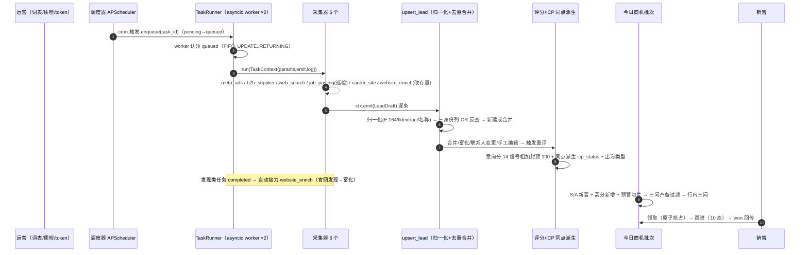
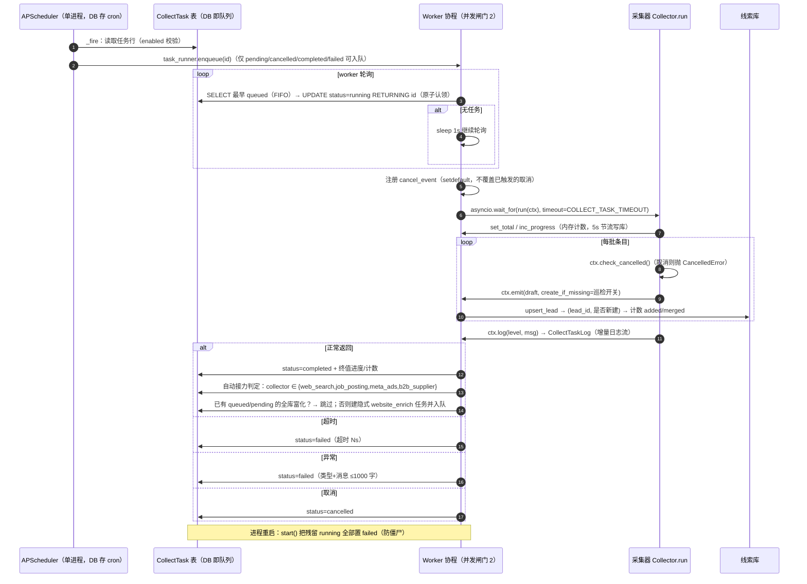
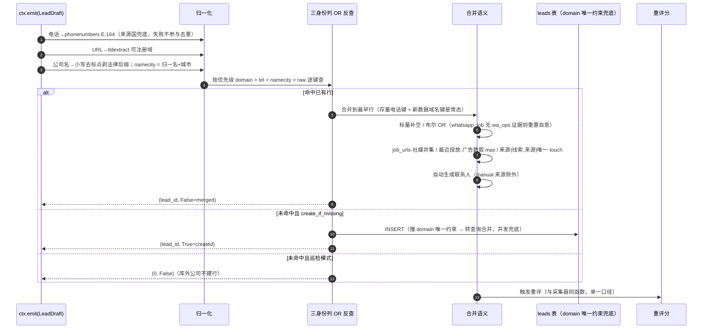
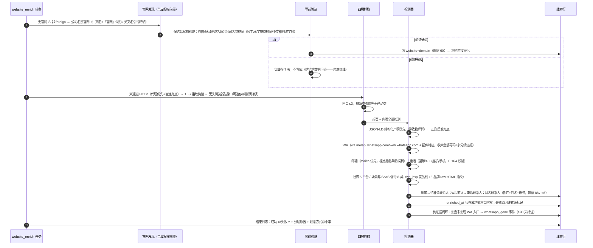
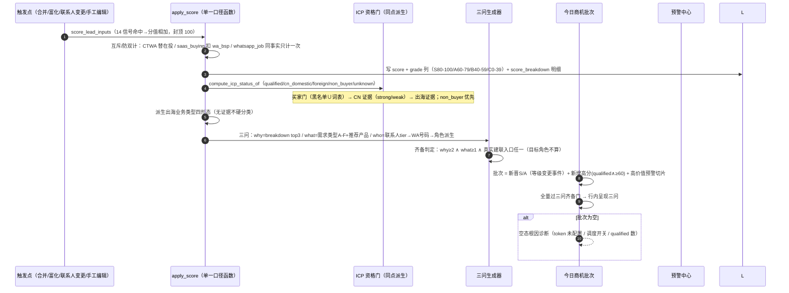
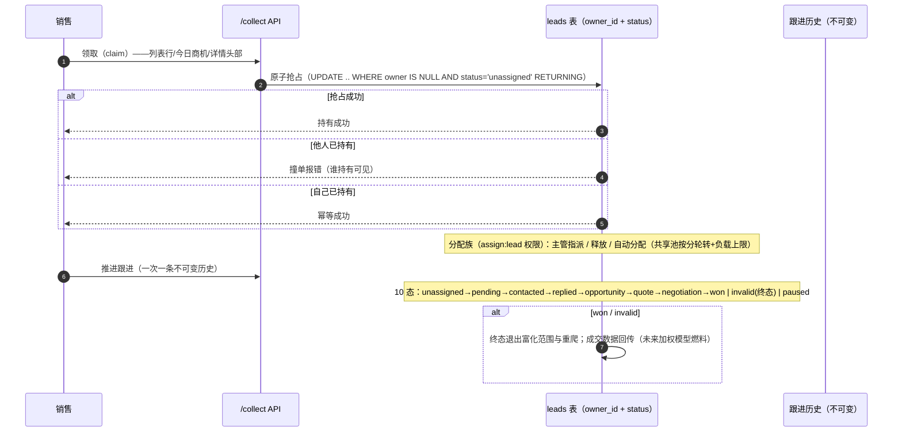
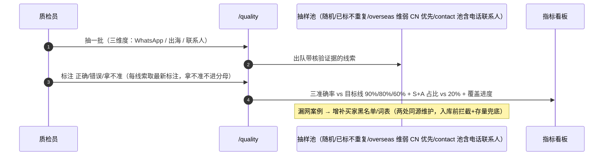

# 线索系统 · 流程时序图与技术方案选型

> 依据：[需求文档.md](需求文档.md)（V1 冻结版，需求唯一真源）+ 当前代码实现（2026-09-01）
> 本文 = 架构视图；业务口径冲突以需求文档为准。

## 1. 需求梳理（一页浓缩）

**核心需求**：作为 WhatsApp 中国 BSP，自动发现「中国企业 ∧ 出海 ∧ 在用 WhatsApp 承接客户」的公司，
评估排序后每天给销售一批可直接建联的客户（卖 SaaS 服务 + WhatsApp 消息，延伸广告代理）。

**两条门 + 一个靶心**：

```
                    ┌───────────── ICP 资格门（硬准入，五态）─────────────┐
6 采集器 → 草稿 → 去重合并 →  qualified/cn_domestic/foreign/non_buyer/unknown
                    └────── 意向分（14 信号加分制，封顶 100，S/A/B/C）──────┘
                                        │
                                   三问生成器（why/what/who 齐备）
                                        │
                                   今日商机批次 → 领取 → 跟进(10态) → won 回传
```

**硬约束（§3，决定一切技术选型）**：纯免费（零付费 API）｜LLM 可空降级｜单进程任务系统（DB 即队列）｜礼貌采集（分窗口节流）｜合规（只采公开信息）｜去重键终态（domain > tel > namecity）。

**系统职责**：不是企业名录，是商机信号工厂——每 1 分意向分可溯源到一条可核查证据；三问齐备才进今日商机；空批次给根因诊断。

---

## 2. 详细流程时序图

### 2.1 主链路全景



### 2.2 采集任务生命周期（含自动接力与取消）



### 2.3 去重合并核心（系统的心脏）



### 2.4 website_enrich 富化时序（联系方式是第一产出）



### 2.5 评分 / ICP / 三问 / 今日商机（同点派生链）



### 2.6 领取与跟进状态机（销售闭环）



### 2.7 质量抽检（质检闭环）



---

## 3. 技术方案选型

### 3.1 后端基础设施

| 关注点 | 选型 | 依据 | 被否决备选 |
|---|---|---|---|
| Web 框架 | **FastAPI + Pydantic v2 + SQLAlchemy 2 (async)** | 异步原生、参数表单动态渲染靠 Pydantic 模式、类型安全 | Django（重）/ Flask（异步弱） |
| 数据库 | **PostgreSQL (asyncpg) 主 / SQLite (aiosqlite) 零配置备选**（`DB_TYPE` 切换） | PG 支持 `UPDATE..RETURNING` 原子认领与 JSON 查询；SQLite 3.35+ 同支持，纯本地体验零依赖 | MySQL（无 RETURNING 语义弱） |
| 迁移 | **Alembic autogenerate** | 与 SQLAlchemy 同生态 | 手写 SQL |
| 任务队列 | **DB 即队列（CollectTask 表 + asyncio worker 协程）** | §3 硬约束单进程；重启不丢任务；无新中间件（纯免费/零依赖） | Celery/Redis/RQ（违反单进程、增依赖） |
| 调度 | **APScheduler AsyncIOScheduler，cron 表达式存 DB，sync() 全量重建** | 任务即数据（前端可建可改）；重启自动恢复；`WORKERS>1` 时防御性关闭 | 系统 crontab（不可前端管理） |
| 并发模型 | **进程内 worker 协程 × `COLLECT_MAX_CONCURRENT`（默认 2）** | 闸门满即排队不失败；进度 5s 节流写库 | 线程池（GIL + 异步生态割裂） |
| 日志 | **loguru + CollectTaskLog 增量日志表** | 任务详情页日志流；重启可追溯 | 仅文件日志（前端不可见） |
| 认证授权 | **JWT + bcrypt + 权限码词表（7 个）** | 三层权限（lead/task/assign）；数据权限三级（all/team/own）强制过滤 | OAuth2 第三方（内网工具过度） |

### 3.2 采集层（纯免费硬约束下的全部通道）

| 采集器 | 选型 | 依据 | 被否决备选 |
|---|---|---|---|
| meta_ads | **Meta 官方 Ad Library API（免费 token）**，httpx 异步 | 唯一免费合法通道拿「在投广告」；CTWA(+40)/在投(+15)/投放国计数都靠它 | 第三方广告库 API（付费） |
| web_search | **DuckDuckGo（零 key）→ 失败自动降级必应中国 → 可选 searxng/google_cse/bing** | 零 key 可用；多引擎降级链保活 | SerpAPI 等（付费，违反 §3） |
| b2b_supplier | **made-in-china.com HTTP 直连解析（robots 允许目录页/店铺页/档案页）** | 国内直连零 key；公开字段全（出口市场/Incoterms）；适配器模式可扩展其他目录 | 海关数据（付费/灰色） |
| job_posting | **jobui/猎聘/前程无忧 HTTP 解析；BOSS/智联 STUB（验证码，归 V1.5）** | 中国招聘平台公开职位页；巡检定位（信号不是发现） | 招聘 API 官方付费 |
| career_site | **官网 + ATS 子域（Moka/北森/51job）递归发现 + 薄壳 SPA 渲染 + 分类器过滤** | 一手在招岗证据置信 90 | 第三方招聘聚合 |
| website_enrich | **双通道 httpx（代理优先+直连兜底）→ TLS 指纹伪装 → 无头浏览器可选降级** | 反爬对抗分层递进；未装浏览器依赖静默降级不炸任务 | Scrapy（重框架）；付费浏览器农场 |
| 归一无 | **phonenumbers (libphonenumber) + tldextract + 自研名称归一** | E.164 校验是去重键质量前提 | libpostal（实证失败不引入，§10 裁决） |
| 结构化抽取 | **stdlib json 解析 JSON-LD 优先 + 正则兜底** | 零依赖采信 schema.org；extruct/trafilatura 实证后否决 | 完整微数据解析栈 |
| 反爬伪装 | **TLS 指纹 impersonate + 分窗口节流（S1/A3/B7/C30 天）+ 终态退出** | 礼貌采集（§3.4）；分级增量重爬 | 高频全量重爬 |

### 3.3 智能判定层

| 关注点 | 选型 | 依据 | 被否决备选 |
|---|---|---|---|
| LLM 接入 | **可空降级：OpenAI 兼容 client + 本机 Ollama 兜底；无 key 全走规则模板并标记来源** | §3.2 LLM 可空；AI 分析/话术是增强不是依赖 | 强制在线 LLM（有 key 才工作 = 违约） |
| 评分模型 | **加分制 14 信号，命中分值相加封顶 100，唯一主分** | 零成交数据时加权只会放大空通道（§10 裁决）；每分可溯源 | 六维加权（已废弃，成交回传后再说） |
| ICP 资格门 | **规则判定五态（买家门→CN 证据 strong/weak→出海证据）** | 硬准入不做有罪推定；weak CN 可见不可藏 | LLM 语义判定（V1.5 才入，且为本机） |
| 三问生成 | **规则派生（breakdown top3 / 需求类型 A-F / 联系人 tier + 角色派生）** | 确定性可解释；LLM 仅润色话术 | 纯 LLM 生成（不可核查 = 违反「每分可溯源」） |

### 3.4 业务核心机制

| 关注点 | 选型 | 依据 | 被否决备选 |
|---|---|---|---|
| 去重键 | **三身份列 domain > tel > namecity（终态）；DB 唯一约束兜底** | 宁漏勿重；并发/发现链/合并三条撞域路径都无重复 | 统一社会信用代码（永久废弃）；模糊匹配（误合并） |
| 领取并发 | **条件 UPDATE 原子抢占（`WHERE owner IS NULL` RETURNING）** | 两人同时领取恰好一人成功；幂等 | 事务锁/应用层先查后改（竞态） |
| 跟进历史 | **不可变追加（一次跟进一条记录）** | 审计可回溯；won/invalid 终态 | 可编辑状态字段（丢历史） |
| 空态诊断 | **今日商机空批次输出根因（token/调度/qualified 数）** | §1「批次为空给根因不给空白」 | 空白页 |
| 错配防线 | **官网两证齐判错 + 连坐清除 + 写前验证（公司名特征词）** | §5 可行动底线；爬准红线（错站数据全清） | 单证判定（误杀/漏放） |
| 数据进出 | **CSV UTF-8 BOM（≤5 万行导出 / ≤5000 行导入 upsert）；种子初始化在空库时一次性导入** | Excel 兼容；幂等重导 | Excel 二进制格式（依赖重） |
| 权限 | **三层 RBAC + 7 权限码 + 数据权限 all/team/own** | V1 只接线 assign:lead 与 stats:read，余为扩展预留 | 逐功能硬编码角色 |

### 3.5 前端

| 关注点 | 选型 | 依据 | 被否决备选 |
|---|---|---|---|
| 框架 | **Vue 3 + TypeScript + Vite** | 脚手架同源（youzi-init-project 硬约束） | React（迁移成本） |
| 组件库 | **naive-ui（unplugin 按需导入）唯一** | 生态硬约束；n-data-table/n-modal/n-config-provider 覆盖全部页面 | Element Plus/AntDV（明令禁止） |
| 图标 | **@vicons（xicons 生态）+ n-icon/renderIcon** | 生态硬约束 | 其他图标库（禁止） |
| 请求 | **@/api/request 统一封装（token 自动带、401 统一弹窗）** | 约定；不手写 fetch | 各页面裸 fetch |
| 确认/提示 | **confirm()（@/utils/feedback）+ message.*** | 约定统一交互 | window.confirm |

### 3.6 关键决策记录（为什么这么选）

1. **DB 即队列而非 MQ**：§3 硬约束「单进程任务系统」+「纯免费」双重否决 Celery/Redis；`UPDATE..RETURNING` 让 PG/SQLite 都支持原子认领，重启靠 `start()` 把 running 置 failed 兜底。
2. **加分制而非加权**：零成交数据时权重纯靠拍脑袋，会放大空通道（2026-08-31 裁决）；加分制每分可溯源，销售直读「这分怎么来的」。
3. **富化不是数据源**：website_enrich 只改存量、不产新线索，因此不在数据源列表/创建对话框（2026-09-01 裁决）；自动接力让它成为发现链的隐式第二步。
4. **LLM 是彩蛋不是地基**：无 key 全链路规则模板可用；Ollama 本机兜底保证「纯免费」不变。
5. **官网必须真是这家公司的**：英文名搜索结果第一站无关站曾致错配联系方式入库——写前验证（公司名特征词）+ 两证判错 + 连坐清除三道防线，这是全系统数据质量的根。
